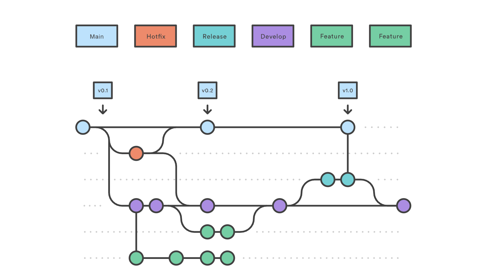

# 🧮 Java Console Calculator

โปรแกรมเครื่องคิดเลข Java บน Command Line ที่ออกแบบมาให้ใช้งานง่าย รองรับการคำนวณพื้นฐานและการจัดรูปแบบตัวเลขที่สวยงาม พร้อมระบบจัดการข้อผิดพลาด (Error Handling) ที่รัดกุม


## 🔄 Workflow & Development Process

ทีมของเราใช้ **Gitflow Workflow** ในการพัฒนา เพื่อแยกส่วนการทำงานระหว่างฟีเจอร์ใหม่, การแก้ไขบั๊ก และเวอร์ชันพร้อมใช้งานอย่างชัดเจน:


*(แผนผังแสดง Workflow การทำงานของทีม)*

### โครงสร้าง Branch
- **🔴 Main:** สำหรับเวอร์ชันที่เสถียร (Production)
- **🟣 (Dev):** Branch หลักสำหรับรวมฟีเจอร์ใหม่จากสมาชิกในทีม
- **🟢 Feature Branches:** สำหรับพัฒนาฟีเจอร์แยก (เช่น `feature/power`, `feature/history`)
- **🟠 Hotfix Branches:** สำหรับแก้บั๊กเร่งด่วนจาก Main

---

## ✨ ฟีเจอร์หลัก (Features)

### 1. การคำนวณพื้นฐาน (Basic Operations)
รองรับการบวก (`+`), ลบ (`-`), คูณ (`*`), และหาร (`/`) ได้อย่างถูกต้อง

### 2. ระบบตรวจสอบข้อมูล (Input Validation)
- มีระบบป้องกัน **Input Error** หากผู้ใช้ใส่ตัวอักษรแทนตัวเลข โปรแกรมจะแจ้งเตือนและให้กรอกใหม่โดยไม่ค้าง (Infinite Loop Prevention)
- ป้องกันการหารด้วยศูนย์ (Divide by Zero Protection)

### 3. การแสดงผลอัจฉริยะ (Smart Formatting)
- จัดรูปแบบผลลัพธ์ให้อ่านง่าย
- ตัดเลข 0 ที่อยู่หลังทศนิยมออกอัตโนมัติ (เช่น `10.500` จะแสดงเป็น `10.5`)
- ปัดเศษทศนิยมให้อยู่ในตำแหน่งที่เหมาะสม

---

## 🚀 วิธีการติดตั้งและใช้งาน (Installation)

1. **Clone โปรเจกต์**
   ```bash
   git clone [https://github.com/your-username/java-calculator.git](https://github.com/your-username/java-calculator.git)

2.  **เปิดและรันโปรแกรม**
    * เปิดโฟลเดอร์ใน IDE (VS Code, IntelliJ, Eclipse)
    * Compile และ Run ไฟล์ `Calculator.java`

3.  **ตัวอย่างการใช้งาน**
    ```text
    Enter first number: 10
    Enter operator (+, -, *, /, ^, %): /
    Enter second number: 3
    Result: 3.333
    ```

## 👥 ทีมผู้พัฒนา (Contributors)

| ชื่อ (Github) | บทบาท (Role) | งานที่รับผิดชอบ |
| :--- | :--- | :--- |
| **CThanarak** | ⭐ Project Lead | Input Validation, Hotfix Management |
| **NekoAida** | 🛠️ Developer | Advanced Math Features (Power, Sqrt) |
| **Narabodee** | 🎨 Developer | Number Formatting System |

---
*Developed as part of Software Engineering Program, Rajamangala University of Technology Lanna, Chiang Mai (RMUTL).*